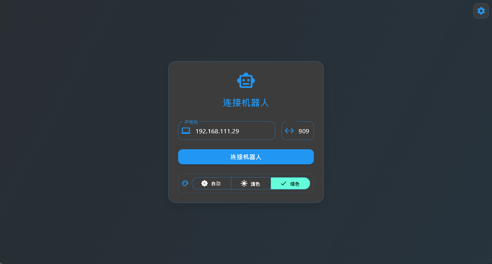
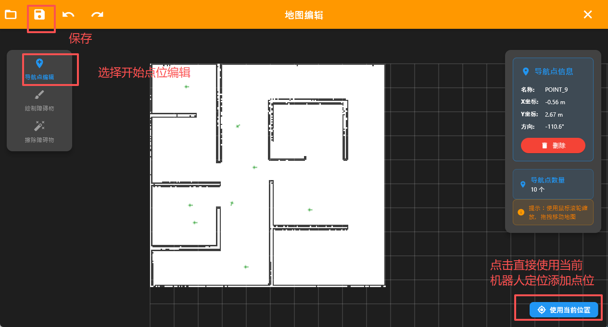
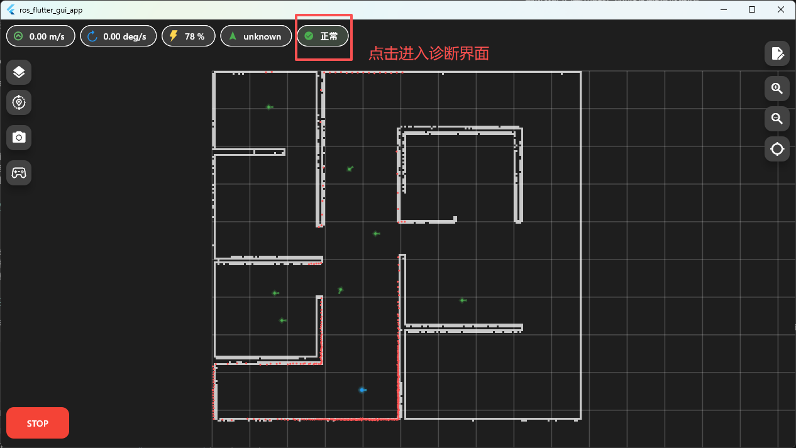
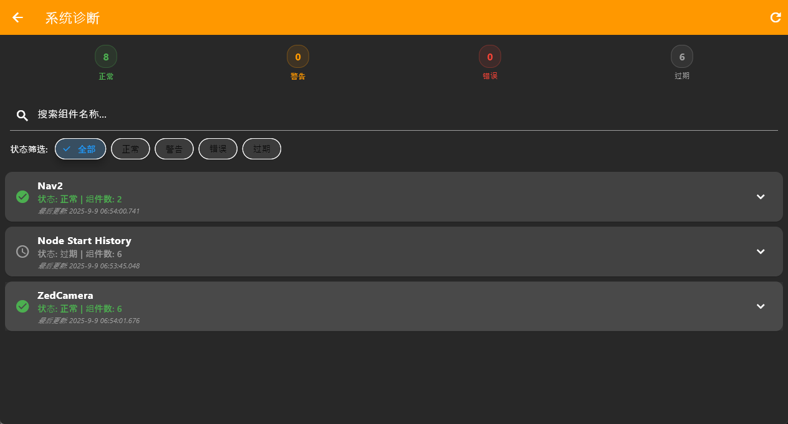
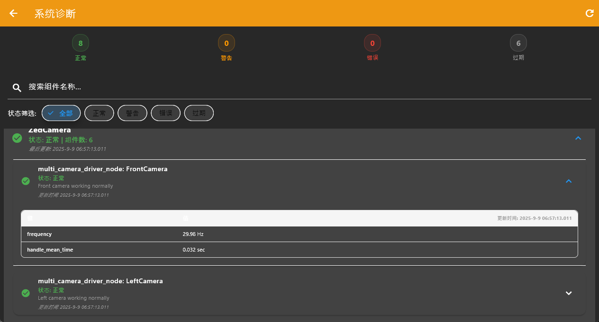

# 使用教程

## 启动ROS环境

1. 启动rosbridge:

```bash
# ROS1
roslaunch rosbridge_server rosbridge_websocket.launch

# ROS2
ros2 launch rosbridge_server rosbridge_websocket_launch.xml
```

2. 启动web_video_server(可选):

```bash
# ROS1
rosrun web_video_server web_video_server

# ROS2
ros2 run web_video_server web_video_server
```

## 连接设置

输入ROS Bridge WebSocket进程启动的地址并点击"Connect"按钮连接，一般端口默认均为9090，不需要更改：
 

## 功能使用

### 地图编辑

点击右上角图标进入地图编辑模式，编辑模式下可添加导航点，障碍物绘制（后续支持）
 

#### 拓扑地图编辑
- 订阅/map/topolog话题，消息类型定义：https://github.com/chengyangkj/topology_msgs
- 点击保存按钮，自动发布/map/topology/update话题的topology地图，消息类型定义：https://github.com/chengyangkj/topology_msgs 用户可接受此话题并做保存




### 机器人控制

- 左侧摇杆控制前进/后退/左右移动
- 右侧摇杆控制旋转
- 点击重定位按钮可手动设置机器人位置


### 相机显示

1. 确保已启动web_video_server
2. 在设置中配置相机话题和端口
3. 点击相机按钮查看图像流

注意：相机显示依赖flutter mjpeg库，但是mjpeg目前不支持web端

 

### 诊断信息显示

点击顶部的状态按钮即可进入诊断界面，这里监听/diagnostics话题，可在设置中更改此话题
 

诊断界面：
 


因为ros2 在所有进程启动时会向/diagnostics发布启动信息，因此APP将进程启动信息统一收集至Node Start History下

软件会对诊断信息作失活判断，如果诊断信息超过5s没发送，会至为失活